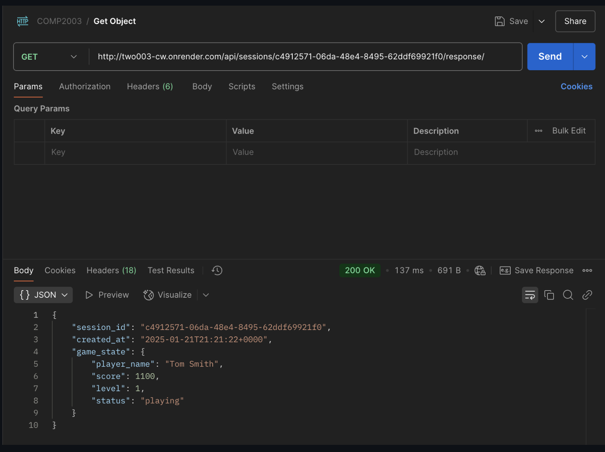
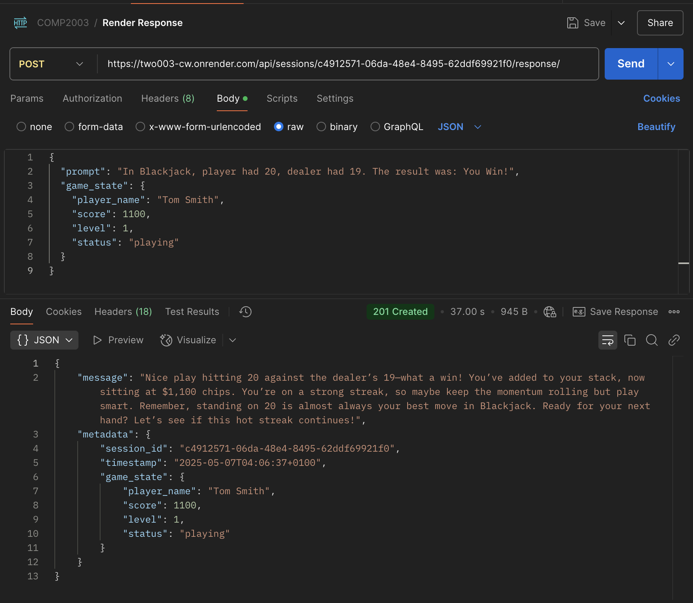
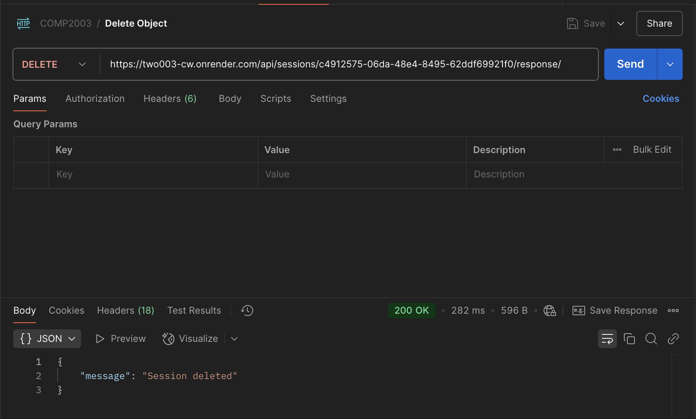
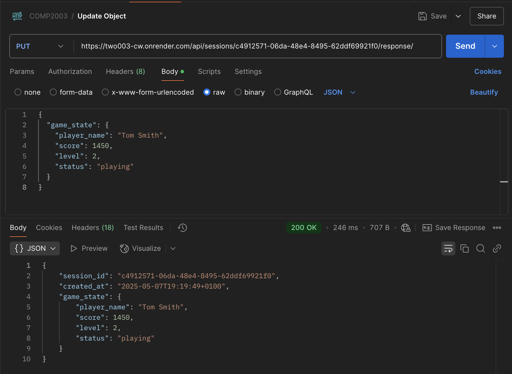
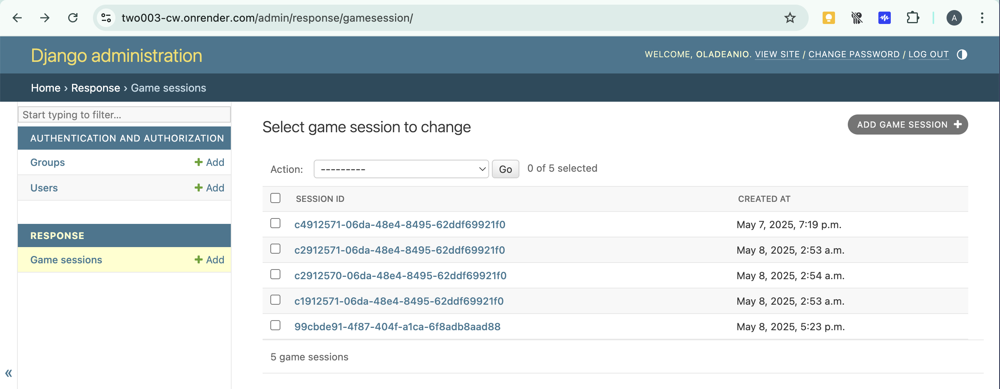

# API Notes

[https://two003-cw.onrender.com/](https://two003-cw.onrender.com/) is the Render-deployed Django API.

By the way, the Django server has been deployed on Render since April 13th, all commits to the API after that was just polishing the API, ApiManager script and the documentation.

## Django Admin Login Details

```plaintext
username: oladeanio
password: root
```

Logs me in as a superuser to the admin interface, where I can manage the session IDs.

`the above login details are only pushed to the repo for coursework demonstration purposes`

---

## API Endpoints

`casino_simulator_api/main/urls.py` {

```python
def health_check(request):
    return JsonResponse({"status": "ok"})

urlpatterns = [
    path('admin/', admin.site.urls),  # Django admin interface
    path('api/', include('response.urls')), # AI response endpoint; use response/urls.py
    path('', health_check), # Health check endpoint for Render confirmation
]
```

- `path('api/', include('response.urls'))` mounts every route defined in **response/urls.py** under the `/api/` prefix. The key endpoint `/api/sessions/<uuid:pk>/response/` handles all the POST, GET, DELETE and PUT requests for each individual GameSession.
- `path('admin/', admin.site.urls)` Used for accessing the Django Admin login page
- `path('', health_check)` Basic health check endpoint to confirm the server is running

The `health_check(request)` function returns a simple JSON response ("status": "ok") indicating the server's status. This is used to confirm the server is running when debugging the game; the request parameter is the HTTP request object, and the function returns a `JsonResponse` with a HTTP 200 JSON response.

}

`casino_simulator_api/response/urls.py` {

```python
urlpatterns = [
    path('sessions/<uuid:pk>/response/', AIResponseView.as_view(), name='ai-response'),
]
```

This urlpattern exposes `/api/sessions/<uuid:pk>/response/` and responds back to Unity:

- **POST** request gets an AI response for Unity
- **GET** request returns the serialised `GameSession` used for debugging or state inspection
- **DELETE** request removes the `GameSession` object and the associated `AIResponse` objects
- **PUT** request updates the `GameSession` object. The `<uuid:pk>` part of the URL is a placeholder for the unique session ID, which is passed to the view as a parameter.

}

## API Views

`casino_simulator_api/response/views.py`

1. `GET` request to fetch the `GameSession` object; calls the `get()` method
2. `POST` request to return a response from OpenAI back to Unity; calls the `post()` method
3. `PUT` request to update the `GameSession` object; calls the `put()` method
4. `DELETE` request to remove a `GameSession` object, cascading to the `AIResponse` object; calls the `delete()` method

Django REST framework automatically works with a specific naming convention for methods like get, post, put, and delete to map incoming HTTP requests to the appropriate method within the view.

When calling `https://two003-cw.onrender.com/api/sessions/<uuid:pk>/response/`, the following methods within the AIResponseView class are called based on the HTTP request type:

`GET` request calls the `get()` method.
`POST` request calls the `post()` method.
`PUT` request calls the `put()` method.
`DELETE` request calls the `delete()` method.

---

##### GET request to fetch the *GameSession* object

```python
def get_object(self, pk):
        try:
            return GameSession.objects.get(pk=pk)
        except GameSession.DoesNotExist:
            raise NotFound("GameSession not found")
def get(self, request, pk=None):
        session = self.get_object(pk)  # fetch the session object
        serialiser = GameSessionSerialiser(session) # serialise the session object
        return Response(serialiser.data)
```

This `get` method retrieves a specific `GameSession` object using the provided `pk` and serialises it using the `GameSessionSerialiser`. It then returns the serialised data in the response. This can be used to allow developers or client applications to fetch the complete current details of a specific game session for debugging, state verification, or administrative oversight.

It uses the `get_object` helper method to fetch the session object based on the provided primary key (`pk`). The `serialiser` variable is an instance of the `GameSessionSerialiser`, which is used to convert the session object into JSON format. Finally, it returns the serialised data in the response back from the Render-hosted API to the sender of the request(Postman).


*Figure 1*

This Postman request (*figure 1)* showing the GET request is fetching the `GameSession` object, sent to the Render-hosted API, which requires no request body; it's used to get a specific user's game-state information.

---

##### POST request to return a *response* from OpenAI back to Unity

```python
    def post(self, request, pk=None):
        # Retrieve the session object
        try:
            session = GameSession.objects.get(pk=pk)
        except GameSession.DoesNotExist:
            # still proceed with a normal request; store the session ID in the sqlite database 
            session = GameSession.objects.create(session_id=pk, game_state=request.data.get("game_state", {})) 
  
        # Extract the prompt from the request
        prompt = request.data.get("prompt")
        if not prompt:
            return Response({"error": "Prompt is required"}, status=status.HTTP_400_BAD_REQUEST) # if Unity doesn't send a prompt, respond with clear error message
  
        # Extract the game_state and player_balance from the Unity -> Django request
        game_state = request.data.get("game_state", {})
        player_balance = game_state.get("score", 0)  # fetch score from game_state
  
        if game_state: # if game state is provided, synchronise it, save to database
            session.game_state = game_state
            session.save()

        # Enhance the prompt's context with constructed player balance info
        final_prompt = f"Player's current balance: ${player_balance}. {prompt}"

        # Call OpenAI API to generate the response
        try:
            response = openai.chat.completions.create(
                model="gpt-4.1-mini", 
                messages=[
                    {"role": "system", "content": system_message},
                    {"role": "user", "content": final_prompt}
                ]
            )
            response_text = response.choices[0].message.content  # Extract text from OpenAI response
        except Exception as e:
            return Response({"error": f"OpenAI API error: {str(e)}"}, status=status.HTTP_500_INTERNAL_SERVER_ERROR)

        # Create and save the AIResponse object
        response = AIResponse(
            session=session,
            prompt=prompt,
            response=response_text
        )
        response.save() # save to database
  
        # Serialise the response
        response_serialiser = AIResponseSerialiser(response).data
        session_serialiser = GameSessionSerialiser(session).data
        print(f"Response Serialiser:\n {response_serialiser}\n")
        print(f"Session Serialiser:\n {session_serialiser}")


        # Return the serialised data
        return Response({
            "message": response_serialiser['response'],  # get 'response' text from serialised AIResponse data
            "metadata": {
                "session_id": session_serialiser['session_id'],  
                "timestamp": response_serialiser['timestamp'], 
                "game_state": session_serialiser['game_state'], 
            }
        }, status=status.HTTP_201_CREATED)
```

Firstly, it retrieves the session object using the provided `pk` (primary key) and checks if a `prompt` is included in the request data; if not, it returns a 400 error response. Then, It proceeds to call the OpenAI API with the constructed `prompt` and the `system_message `and returns the AI’s response, together with the `session_id `and `game_state` in the JSON payload sent back to Unity.

If any error occurs during the OpenAI API call, it returns a `500` error response with the error message.

It updates and saves the session’s game state when a new `game_state` field is present, saves the `prompt` and `response_text` i.e. the prompt and generated response, as an AIResponse entry for storage and debugging; it serialises the response data in Django, then sends the combined data, i.e. the `message` and the API's `metadata` which contains the `session_id`, UK `timestamp`, and the `game_state`, back to the client (Unity).

In the following screenshot (*figure 2*) the POST request is simulated using Postman, because the Unity game is normally the client for the POST request; it shows it works on the Render-hosted API, the JSON body contains the `prompt` and `game_state` fields, which are sent to the API from Unity. The response includes the AI's generated message, the session ID, and the timestamp of when the response was created.


*Figure 2*

---

##### DELETE request to remove a *GameSession* object

```python
def delete(self, request, pk=None):
        # Delete a session and cascade to AIResponses
        try:
            session = GameSession.objects.get(pk=pk)
        except GameSession.DoesNotExist:
            raise NotFound("GameSession not found")

        session.delete()  # cascades to AIResponse via FK
        return Response({"message": "Session deleted"}, status=status.HTTP_200_OK)
```

In *figure 3* the `delete` method allows for the deletion of a specific `GameSession` object using the provided `pk`. It raises a `NotFound` error if the session does not exist. When processing the deletion it cascades to the associated `AIResponse` objects due to the foreign key relationship, ensuring that all related data is removed.


*Figure 3*

---

##### PUT request to update the *GameSession* object

```python
    def put(self, request, pk=None):
        # Update the game state of an existing session
        try:
            session = GameSession.objects.get(pk=pk)
        except GameSession.DoesNotExist:
            raise NotFound("GameSession not found")

        game_state = request.data.get("game_state")
        if game_state is None:
            return Response(
                {"error": "game_state field is required"},
                status=status.HTTP_400_BAD_REQUEST
            )

        session.game_state = game_state
        session.save()

        serialised = GameSessionSerialiser(session).data
        return Response(serialised, status=status.HTTP_200_OK)
```

*figure 4* shows the `put` method updating the `game_state` of an existing `GameSession` object. It retrieves the session using the provided `pk`, checks if the `game_state` field is present in the request data, and updates the session's game state accordingly. If successful, it returns the updated session data in the response. This could be used for administrative purposes e.g. to fix corrupted game state.


*Figure 4*

---

```python
class GameSessionSerialiser(serializers.ModelSerializer):
    class Meta:
        model = GameSession
        fields = ['session_id', 'created_at', 'game_state']

class AIResponseSerialiser(serializers.ModelSerializer):
    # Force British timezone
    timestamp = serializers.DateTimeField(
        format='%Y-%m-%dT%H:%M:%S%z',
        default_timezone=ZoneInfo('Europe/London'),
    )
    class Meta:
        model = AIResponse
        fields = ['session', 'prompt', 'response', 'timestamp']
```

The `GameSessionSerialiser` and `AIResponseSerialiser` classes are serialisers for the `GameSession` and `AIResponse` models respectively. They define how these models are represented in JSON format when sent to or received from the API. The `fields` attribute specifies all the fields of the model that should be included in the serialised output. The `AIResponseSerialiser` forces the timestamp to be in the British timezone using the `ZoneInfo` module.

## API Models

`casino_simulator_api/response/models.py` {

```python
class GameSession(models.Model):
    session_id = models.UUIDField(primary_key=True) 
    created_at = models.DateTimeField(auto_now_add=True)
    game_state = models.JSONField()

class AIResponse(models.Model):
    session = models.ForeignKey(GameSession, on_delete=models.CASCADE)
    prompt = models.TextField()
    response = models.TextField() # Essentially response.choices[0].message.content from OpenAI
    timestamp = models.DateTimeField(auto_now_add=True)
```

The `GameSession` model represents a game session with a unique session ID, creation timestamp, and game state stored in JSON format. The `AIResponse` model represents the AI's response to a prompt, linked to a specific game session. It includes the prompt text, the AI's response text, and a timestamp for when the response was generated.

The `ForeignKey` relationship between `AIResponse` and `GameSession` allows for tracking which AI response corresponds to which game session. The `on_delete=models.CASCADE` argument ensures that if a game session is deleted, all associated AI responses are also deleted.

The response(`models.TextField()`) is essentially the response.choices[0].message.content from the OpenAI API call, which contains the AI's generated text based on the prompt and parts of the game state.

}

## Django Admin


*Figure 5*

Note the game sessions stored in the Django admin interface(*figure 5*), these include instances of the game that are automatically created by Unity and sent in the API request when the user starts a new game, linking the session ID to respective game states.

The `ApiManager.cs` either creates a new UUID (`Guid.NewGuid().ToString()`) when the user is starting a new game, or retrieved the existing UUID  from `PlayerPrefs` on a specific game's subsequent launches; it sends the `sessionId` in the url path to the Django API like `/api/sessions/<sessionId>/response/`

Then, the request gets to Django, where it extracts the UUID from the url and stores it; the `post()` method uses the UUID sent from Unity, and find a game session with that UUID and if it doesn't exist (because it's the first request for this session), it **creates** a new `GameSession` record in the *API's database* using that UUID as the primary key. On subsequent requests with the same UUID, it finds and uses the existing record.

## Appendix

- [Django REST Framework](https://www.django-rest-framework.org/)

```python
system_message = '''
You are the charismatic AI host of the Casino Simulator. Your goal is to create an engaging, realistic casino experience while helping players understand the games.

Respond like this exactly, concisely: "
1- Acknowledge their current action or bet with appropriate casino atmosphere
2- Explain the outcome of their bet clearly (wins, losses)
3- Provide helpful context about their current standing (chips, streak, etc.)
4- Suggest possible next moves based on their situation
5- Occasionally offer a brief gambling tip or strategy insight
6- Keep responses concise and lively (50-75 words maximum)

Maintain a balanced, realistic tone and celebrate wins enthusiastically; but don't overpromise future success. The experience should feel authentic to a real casino 
where the user isn't being pressured to gamble more, but rather encouraged to enjoy the game.
'''
```

The `system_message` is a string containing the system prompt sent to the AI so it is aware of the required characteristics for its responses. I learnt to use dashes for numbered lists from COMP2000.
